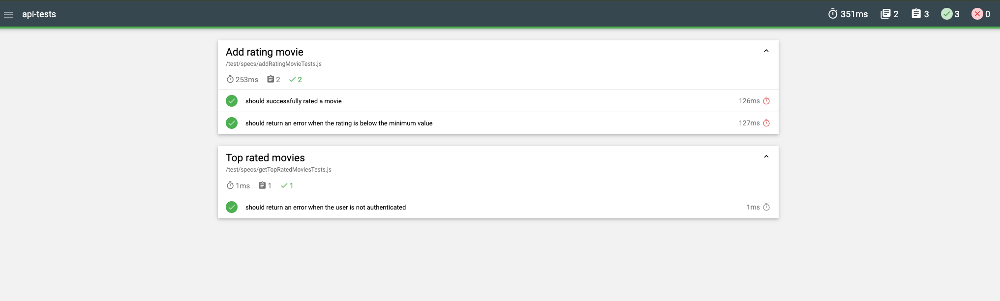
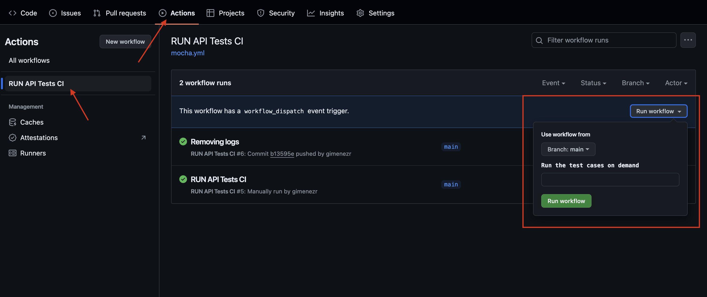
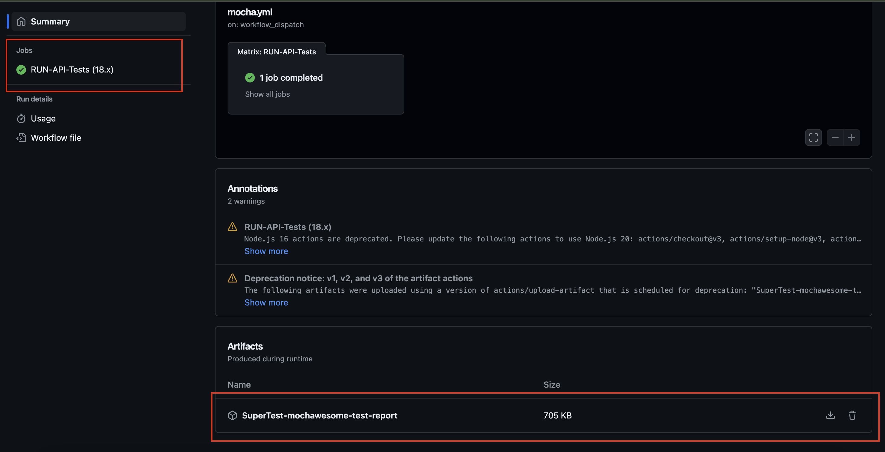

# QA Assigment - API tests

For the API testing project, I used Supertest and Mocha as the testing framework, along with Chai for assertions.

## Installation
To install the repository and its dependencies using npm, follow these steps:

```bash
npm ci
```

## Running Tests and Viewing Reports

- To run the tests locally, you need to set up an `.env.local ` file with the `BASE_URL` and `TOKEN` parameters. Refer to `.env` for an example.
    - Running Tests Locally: `npm run test`
    - Running Tests and Generating Reports: `npm run test-report`
        - o view the report locally, navigate to the repository folder, locate the `mochawesome-report` directory, and open the `.html` file.
        

## GitHub Actions Integration

Automated testing is set up using GitHub Actions:

1. Navigate to the Actions tab in your GitHub repository.
2. Select the workflow named RUN SuperTest API Test CI.
3. Click the Run workflow button on the right.
4. Wait for the workflow to complete.
5. To view the generated report: Go to the finished job. Scroll down and access the attached report.

Workflow


Report



## How to execute a dockerize environment

```bash
docker buildx build . -t api-test
```

2. Run docker with tests and report generation

```bash
docker run --env-file .env.local -v ~/reports:/app/mochawesome-report -it --rm api-test
```
